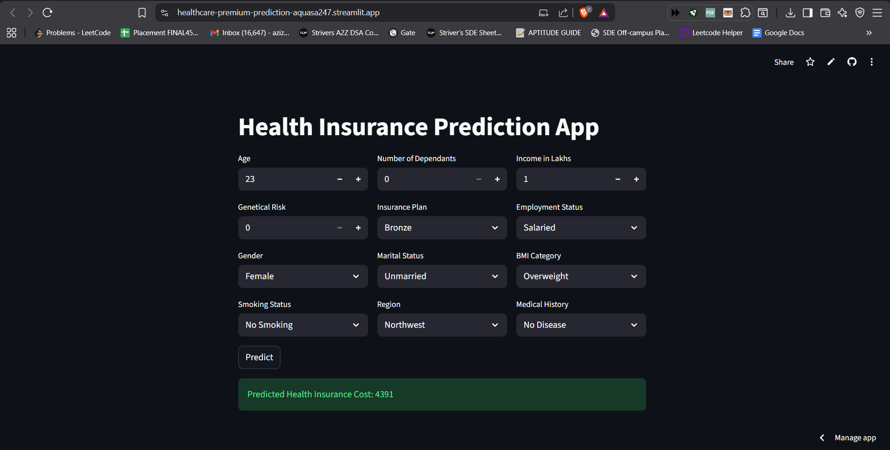

# 🏥 Healthcare Premium Prediction using Machine Learning  

An interactive **Streamlit web app** that predicts **health insurance premium costs** based on user inputs like age, income, BMI, and medical history.  
Deployed on **Streamlit Community Cloud** — it provides an easy, real-time premium estimation tool for users and insurers alike.

🔗 **Live App:** [Healthcare Premium Prediction App](https://healthcare-premium-prediction-aquasa247.streamlit.app/)  
📸 **Preview:**  


---

## 💡 Overview  
This project aims to **predict the healthcare insurance premium** an individual might pay, using demographic, lifestyle, and medical parameters.  
It uses supervised machine learning models to provide accurate, data-driven predictions for better decision-making in the insurance domain.

---

## ⚙️ Tech Stack  
- **Language:** Python  
- **Frontend/UI:** Streamlit  
- **Libraries:** Pandas, NumPy, scikit-learn, joblib, matplotlib, seaborn  
- **Deployment:** Streamlit Community Cloud  

---

## 🧠 ML Workflow  

### 1️⃣ Data Preprocessing  
- Handled missing values  
- Encoded categorical variables  
- Normalized continuous features  

### 2️⃣ Model Training  
- Tried multiple ML models: Linear Regression, Random Forest, XGBoost  
- Evaluated using **R²**, **MAE**, and **RMSE**  
- Selected the best-performing model (XGBoost)

### 3️⃣ Model Deployment  
- Serialized trained model using `joblib`  
- Integrated with a user-friendly **Streamlit UI**  
- Hosted on **Streamlit Community Cloud**

---


## 🧩 Input Parameters  

| Parameter | Type | Example |
|------------|------|----------|
| Age | Numeric | 23 |
| Gender | Categorical | Female |
| BMI Category | Categorical | Overweight |
| Income in Lakhs | Numeric | 1 |
| Smoking Status | Categorical | No Smoking |
| Medical History | Categorical | No Disease |
| Insurance Plan | Categorical | Bronze |
| Employment Status | Categorical | Salaried |
| Marital Status | Categorical | Unmarried |
| Region | Categorical | Northwest |
| Genetical Risk | Numeric | 0 |
| Dependents | Numeric | 0 |

---

## 🧰 Project Structure  

Healthcare-Premium-Prediction

app/
   ├── main.py
   ├── prediction_helper.py
   

artifacts/
   ├── model_young.joblib
   └── model_adult.joblib

data/
   └── healthcare_data.csv

notebook/
   └── EDA_Healthcare_Premium.ipynb

requirements.txt
LICENSE
README.md
.gitignore
Output_Screenshot.png


---

## 💻 How to Run Locally  

```bash
# Clone repository
git clone https://github.com/AquasaAziz247/Healthcare-Premium-Prediction.git

# Navigate to folder
cd Healthcare-Premium-Prediction

# Install dependencies
pip install -r requirements.txt

# Run Streamlit app
streamlit run main.py
```

📚 Future Enhancements

🔹 Add SHAP or LIME for model explainability

🔹 Enable batch predictions (CSV upload)

🔹 Store user input logs in a database (MongoDB / Firebase)

🔹 Deploy on AWS EC2 or Docker for scalability


🧑‍💻 Author

👩‍💻 Aquasa Aziz
🎓 B.Tech in Computer Science and Business Systems (3rd Year)
💬 Passionate about Data Science, Machine Learning, and AI-driven products

